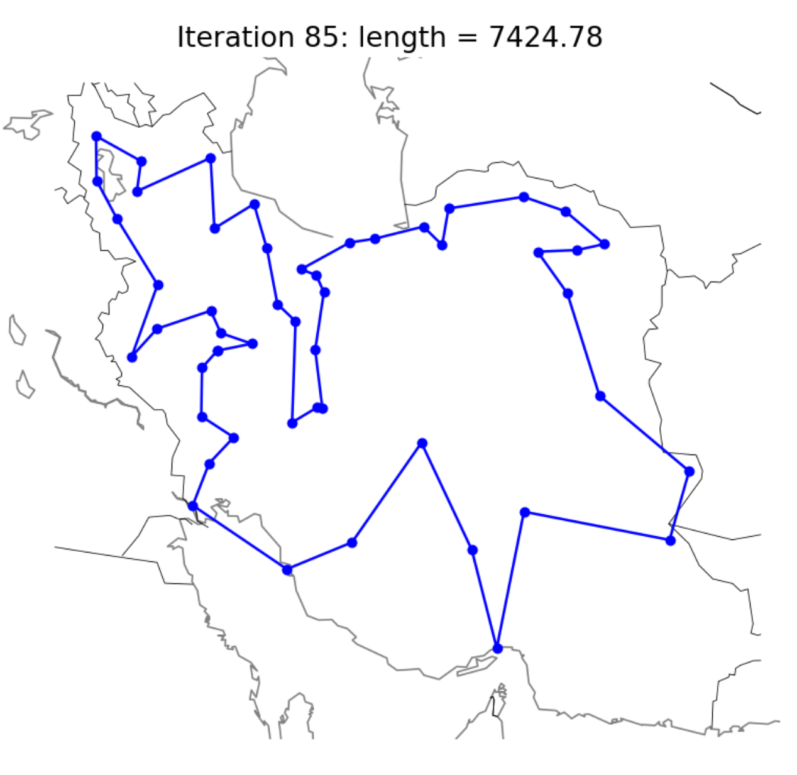

# AI-Programming-using-Python
This repository contains implementation of different AI algorithms, based on the amazing AI book [Artificial Intelligence: A Modern Approach](http://aima.cs.berkeley.edu).
## Contents

### First part:
- Search problems
    - Uninformed search strategies:
        - BFS, DFS, UCS, DLS, IDS
    - Informed search strategies:
        - Gready, A-star
    - Local search:
        - Hill climbing, Simulated Annealing, Genetic algorithms
    - Adversarial search and games
        - MiniMax, alpha-beta pruning

### Second part:
- Machine learning
    - Supervised learning:
        - KNN, Naive Bayes, Desision Trees, SVM, Neural Nets
    - Unsupervised learning:
        - k-Means clustering
    - Reinforcement learning
        - Q-learning

### Example problems
- Search:
    - N-Puzzle, N-Queens, TSP
- Games:
    - Pacman, Chess
- Learning:
    - Pacman, Chess, etc.

### Lesson 1: Uninformed (blind) search strategies
- Implementing data structures like stack, queue and priority queue
- Implementing N-Puzzle (8-Puzzle)
- Implementing uninformed search strategies: BFS, DFS, UCS, DLS, IDS
- Programming assignment

### Lesson 2: Informed search strategies
- Implementing informed search strategies: Greedy, A-star
- Programming assignment

### Lesson 3: Local search
- Implementing N-Queens and TSP(a graphical implementation)
- Implementing local search strategies: hill climbing, simulated annealing and genetic algorithms
- Programming assignment

### Lesson 4: Adversarial search and games
- Implementing Otello
- Implementing adversarial search algoritms: Minimax and alpha-beta prunning
- Programming assignment

## Prerequisite
- Basic knowledge of programming (Python)
- Basic knowledge of data structures and algorithms

## After first part:
- You will have a good understanding of basic AI techniques (solving problems using searching)
- You will become a real python programmer and most importantly a real programmer!
- You will see a lot of programming challenges and you will learn how to solve them

## Reference

